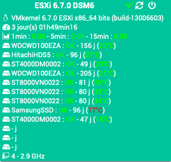

Plugin Esxi
=============

Plugin pour monitorer les machines virtuelles Vmware ESXi via Jeedom.

> **Note**  
> Ce plugin ne fonctionne qu'avec machines virtuelles Vmware ESXi.
> Le serveur SSH de Vmware doit être activé.

**Fonctionnalités :**

- Éteindre / redémarrer,
- Affichage de la distribution,
- Affichage du temps d'activité,
- Affichage de la charge système,
- Pour chaque disque dur : Nom / État / Temps d'utilisation / Température,
- Nombre CPU, fréquence.

**Modèles compatibles**
- Machines virtuelles Vmware ESXi avec SSH activé.

Dashboard
=========

Configuration du plugin
=======================

Après téléchargement du plugin, activer le plugin.

Configuration des équipements
=============================

La configuration des équipements est accessible à partir du menu *Plugins > Monitoring > Esxi*.

### Onglet Equipement:

-   **Nom de l'équipement Esxi** : nom de votre équipement (ex ESXi 6.7.0),
-   **Objet parent** : indique l’objet parent auquel appartient l’équipement,
-   **Catégorie** : les catégories de l’équipement (il peut appartenir à plusieurs catégories),
-   **Activer** : permet de rendre votre équipement actif,
-   **Visible** : rend votre équipement visible sur le dashboard,
-   **Carte réseau** : méthode réseau d'accès à l'équipement,
-   **Local ou déporté ?** : équipement en local ou déporté,
-   **Adresse IP** : adresse IP de Vmware ESXi,
-   **Port SSH** : port de connexion SSH,
-   **Identifiant** : identifiant de connexion (root par défaut),
-   **Mot de passe** : Mot de passe associé à l'identifiant.

### Onglet Commandes

Les commandes de bases sont générées automatiquement

### Liste des versions

*[Voir la liste des versions](changelog.md)*
